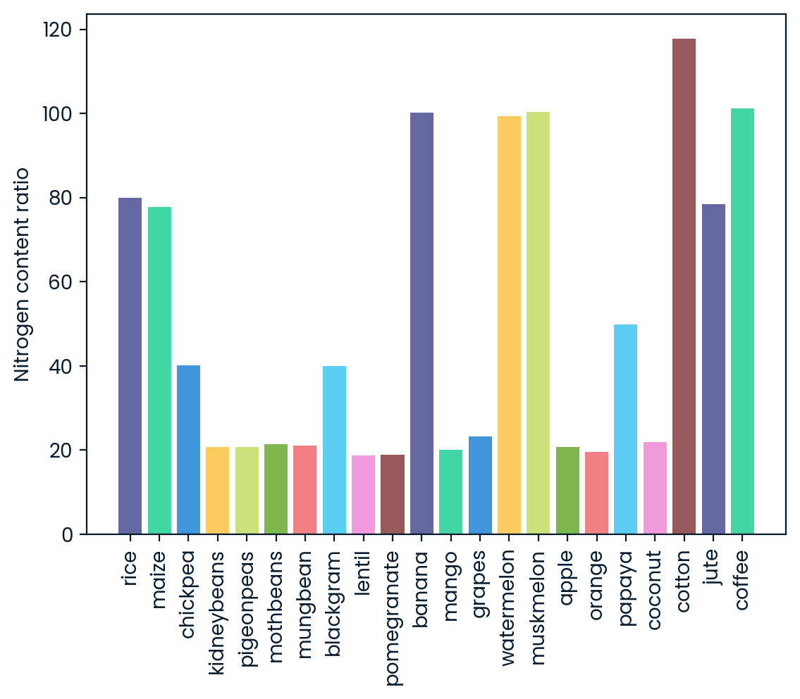
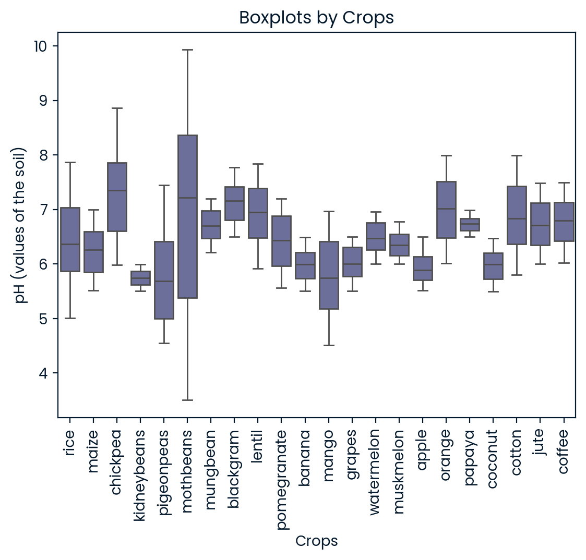

# Optimizing Crop Selection with Predictive Modeling

This project aims to leverage supervised machine learning techniques to assist farmers in selecting the most suitable crops for specific land areas based on soil characteristics. The dataset includes four predictors: soil metrics such as nitrogen, phosphorus, potassium levels, and pH. The target variable is the crop type, categorized as a multi-class classification problem.

## 1. Data Visualization

* barplot

* boxplot

## 2. Supervised Learning Modeling

In this project, we applied three supervised classification models: KNN, Decision Tree, and Logistic Regression. The data was scaled prior to model fitting, and cross-validation was utilized to evaluate each model's performance. Finally, we compared the accuracy of the three models, with the Decision Tree model demonstrating the highest accuracy overall.
